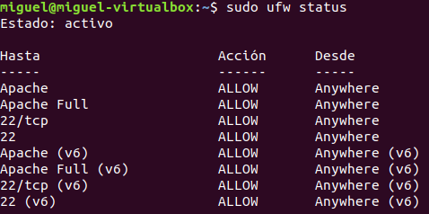
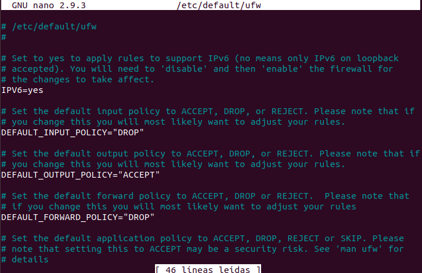
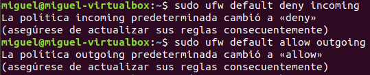
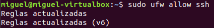
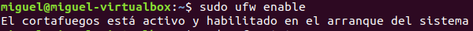
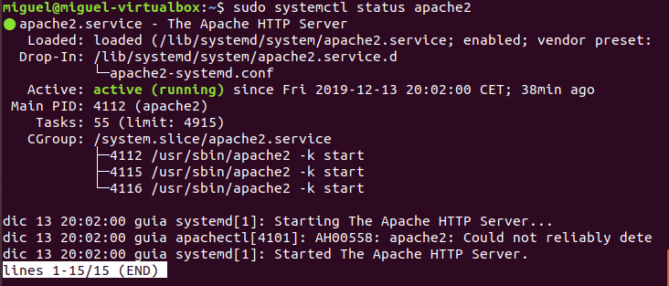
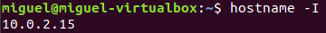
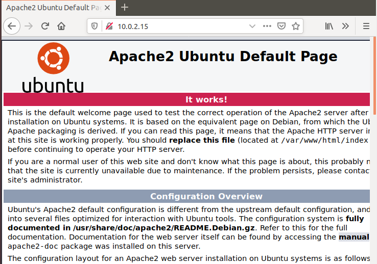

Antes de realizar la instalación del servidor apache debes buscar sus requisitos mínimos y comparalos con tu ordenador. ¿Puedes instalarlo?

1. Para realizar la instalación primero debemos actualizar los paquetes locales para se descarguen las nuevas versiones de los paquetes.

 
2. Después instalamos el paquete *apache2*.

3.El siguiente paso es modificar los ajustes del cortafuegos para que se garantice el acceso externo a los puertos web. Por defecto, tenemos un cortafuegos *UFW* configurado para restringir el acceso a nuestro servidor.
Durante la instalación se registran los perfiles que permitan habilitar o no su acceso a través del cortafuegos.
Listamos los perfiles con:

4.Como aún no hemos configurado el *SSL* para nuestro servidor solo permitiremos el tráfico a través del puerto 80

5.Podemos ver que realmente ha cambiado con este comando:

Si muestra que sigue inactivo sigue estos pasos, si no, salta hasta el décimo paso.

6.Para activarlo debemos asegurarnos de que en  el fichero *UFW* el valor de IPV6 sea *yes*.

7. Ahora debemos restablecer los valores predeterminados de las reglas *UFW*, para ello:

8. Si ahora habilitáramos el firewall de *UFW* denegaría todas las conexiones entrantes, para configurarlo de manera que permita las conexiones entrantes introduciremos el siguiente comando:

9.Por último solo debemos habilitar el UFW.

10. El servidor web debería estar ya activo y en ejecución, para verificar que está en correcto funcionamiento debemos introducir el siguiente comando y ver por pantalla el siguiente resultado:

11.OPCIONAL. Para saber con toda seguridad que nuestro servidor se ha instalado y funciona de manera correcta la mejor opción es solicitar una página web al servidor Apache. 
Si no sabemos la dirección IP de nuestro servidor introduciremos el siguiente comando y nos devolverá la IP.

Y accedemos desde el navegador de la siguiente manera: *http://ip_servidor*

