## Instalación y configuración de un servidor web.

Para instalar el servidor web vamos a trabajar con una máquina virtual desde Oracle VM VirtualBox. [Aquí](https://www.virtualbox.org/) encontrarás qué es VirtualBox, como descargarlo y como funciona. El sistema operativo que hemos elegido para instalarlo es Ubuntu 18.04 que encontrarás en el siguiente [enlace](http://cdimage.ubuntu.com/netboot/18.04/).

[Aquí](https://www.youtube.com/watch?v=VTGDqFZ81JY&list=PL9oB7UFHn_bQICy3WlzK6IwQMx4HBoe_Y&index=1) una guía de como instalar el sistema operativo en VirtualBox con las tarjetas de red necesarias para realizar la práctica. 

Para instalarlo vamos a utilizar la herramienta [Webmin](http://www.webmin.com/), que nos permite administrar el sistema desde un navegador. En este [enlace](https://www.youtube.com/watch?v=2143l30jiow&list=PL9oB7UFHn_bQICy3WlzK6IwQMx4HBoe_Y&index=2) encontrarás una guía de como instalar Webmin y aplicar la configuración de tarjetas de red.

Ahora que ya hemos preparado el entorno de trabajo, vamos a empezar a isntalar el servidor Apache.

1. El primer paso es acceder a **Webmin** y dentro de esa pestaña pinchamos en *Configuración de Webmin*
  
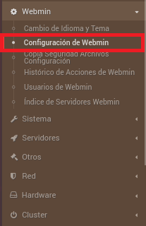

2. Nos aparecerá un menú con diferentes opciones, nosotros utilizaremos *Módulos de Webmin*.

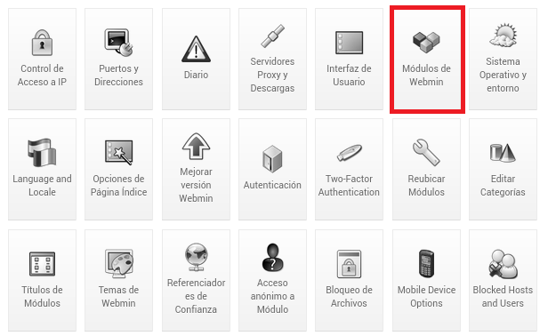

3. Ahora tenemos que elegir desde donde queremos instalarlo. Por defecto está seleccionada la opción *Desde archivo local* pero nosotros utilizaremos el *Módulo estándar de www.webmin.com* y pulsando en el icono señalado en la imagen a continuación elegiremos el módulo Apache.

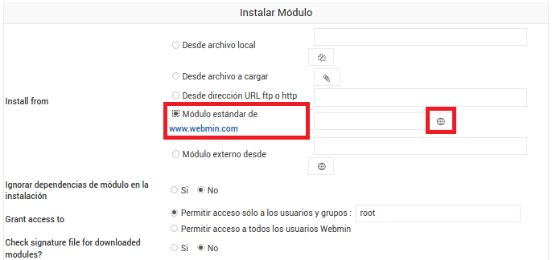

4. En la barra de buscador buscamos *Apache*, lo seleccionamos y clicamos en Select.

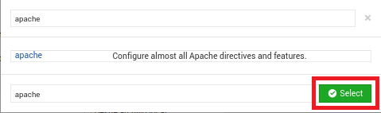

5. Ahora solo debemos clicar en Instalar módulo.

6. Una vez que le hemos dado nos aparece un proceso de descarga e instalación.

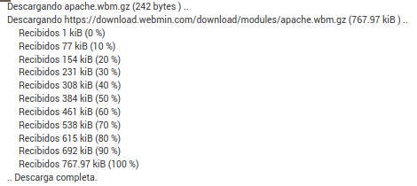

7. El último paso de la instalación es comprobar que realmente el servidor está funcionando. Para ello, escribiremos nuestra dirección IP seguida de dos puntos y 80 en la barra de direcciones. Por ejemplo: 10.0.2.15:80.

Si funciona correctamente, debería aparecer la página por defecto del servidor web Apache.

Ahora que ya tenemos nuestro servidor Apache instalado, vamos a crear un servidor web virtual para poder discriminarlo. Pero para ello neccesitamos configurar un nombre DNS, [aquí](https://www.youtube.com/watch?v=zavT_BAir-4&list=PL9oB7UFHn_bQICy3WlzK6IwQMx4HBoe_Y&index=7/) tenemos una guía de como hacerlo.

1. Una vez que ya hemos creado el nombre DNS, desde **Servidores** accedemos al *Servidor Web Apche*.

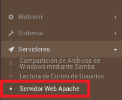

2. Nos vamos al apartado de Create virtual host, en el que rellenaremos los campos seleccionados en la imagen. Para este paso deberás crear un directorio con el nombre del nombre DNS en el directorio raíz y un documento html con la siguiente estructura:

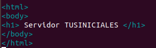

Recuerda que la dirección debe ser "servidorTUSINICIALES.com".

El puerto será el 80 por que es el que utiliza Apache por defecto.

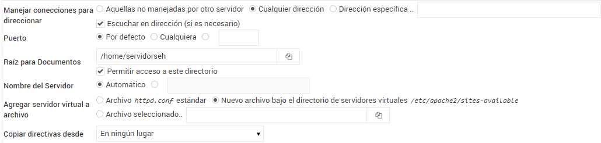

3. Ahora en vez de aparecernos la página por defecto de Apache nos aparece el documento html creado en el paso anterior. Recuerda que para acceder a él debes hacerlo con tu IP seguido de dos puntos y el puerto 80.

Una vez que ya hemos llegado a este punto, debemos discriminar nuestro servidor virtual. Puede hacerse de tres formas distinas:

* Por puerto. Lo primero que debemos hacer es crear un nuevo directorio en la carpeta de nuestro servidor que se llamara *puertos* y dentro de ella crearemos otro fichero html que se llame **index.html**con la siguiente estructura:

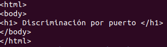

Ahora solo debemos crear un nuevo sitio virtual, en el que en el apartado de Puerto escribimos el puerto por el que queremos discriminar y en Raiz para Documentos seleccionamos la carpeta que hemos creado.

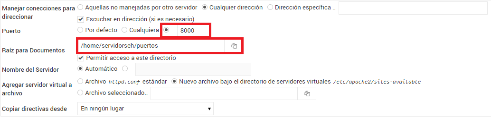

Así como está configurado el puerto que hemos elegido no funcionará porque nuestro servidor no sabe que debe escuchar el puerto hemos puesto. 

Para que lo escuche debemos ir a la configuración global del servidor Apache y elegimos la opción Editar Archivos de Configuración. 

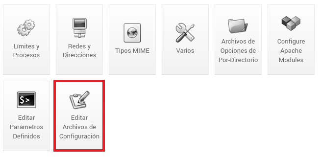

En la barra desplegable superior elegimos el archivo */etc/apache2/ports.conf*.
Añadimos Listen NUMERODEPUERTO.

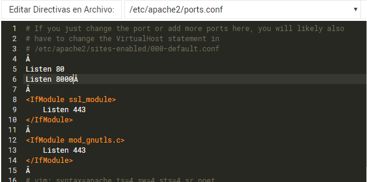

Para combrobar que funciona debemos aplicar los cambios y acceder con la dirección IP de nuestro servidor seguido de dos puntos y el puerto por que hemos elegido para discriminar.

* Por IP. Debemos volver a crear una carpeta especifica que se llame *ip* y un archivo html que se llame **index.html**con la siguiente esctructura:

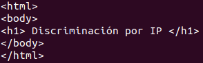

Ahora que ya tenemos el archivo creado tenemos que crear el nuevo sitio virtual. Para ello rellenaremos la casilla Dirección específica con una dirección IP que esté dentro de nuestro rango.

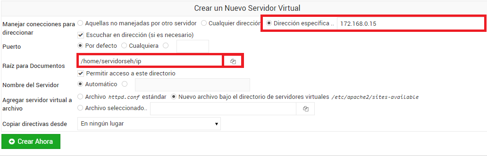

Para comprobar que funciona tenemos que aplicar los cambios y acceder poniendo la dirección IP con la que hemos asignado.

[Volver a la página principal](https://extremera97.github.io/HTTP/)
