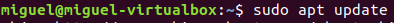
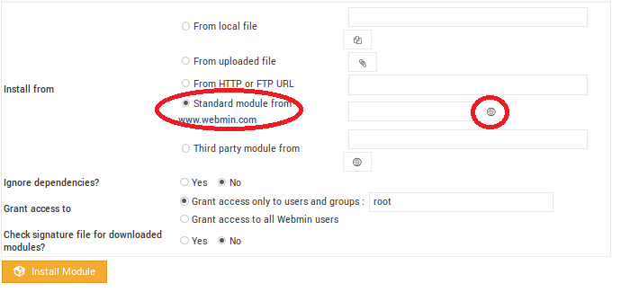
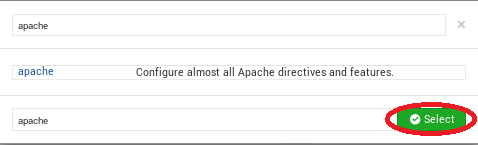
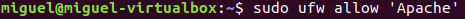
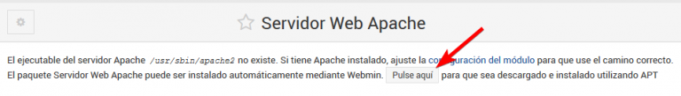
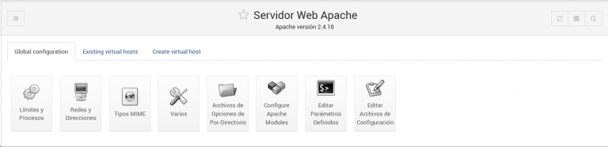
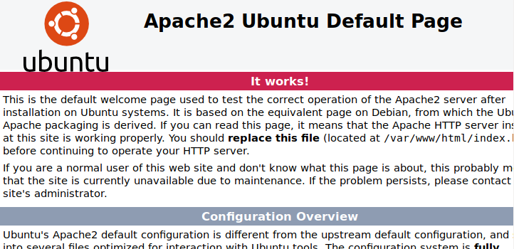

## Instalación y configuración de un servidor web.

Para instalar el servidor web vamos a trabajar con una máquina virtual desde Oracle VM VirtualBox. [Aquí](https://www.virtualbox.org/) encontrarás qué es VirtualBox, como descargarlo y como funciona. El sistema operativo que hemos elegido para instalarlo es Ubuntu 18.04 que encontrarás en el siguiente [enlace](http://cdimage.ubuntu.com/netboot/18.04/).

Para instalarlo vamos a utilizar la herramienta [Webmin](http://www.webmin.com/), que nos permite administrar el sistema desde un navegador. [Aquí](https://www.solvetic.com/tutoriales/article/5427-como-instalar-webmin-en-ubuntu-18-04/) una guía de como instalarlo.

Ahora que ya hemos preparado el entorno de trabajo, vamos a empezar a isntalar el servidor Apache.

El primer paso es Acceder a los **Módulos de Webmin**.
  

Al clicar, nos aparece una pantalla que pregunta dónde queremos instalar el módulo. Nosotros elegiremos la opción de instalarlo desde un módulo estándar de www.webmin.com.

Luego pinchamos en el icono que hay señalado en la imagen a continuación.
  

Al clicar se mostrará una ventana con todos los módulos que podemos descargar, seleccionamos **Apache** y después pinchamos en **Select**.

Ahora solo debemos instalar el módulo.

Ahora que ya tenemos el módulo instalado, lo siguiente que debemos hacer es instalar el paquete Apache. Para ello debemos ir al apartado *Un-used Modules*, pulsar sobre *Servidor Web Apache* y por último donde pone "Pulse aquí".
  

Una vez termiando el proceso de instalación buscamos Apache en el buscador y pinchamos en él.
  

El último paso es comprobar que el servidor funciona, para ello escribimos la *ip del servidor* y el *puerto 80*.

Deberá aparecer esta página si funciona correctamente.
  

Ahora que ya hemos finalizado la instalación de nuestro servidor debemos configurarlo. Normalmente accedemos a sitios web por [nombres DNS](https://es.ryte.com/wiki/Sistema_de_Nombres_de_Dominio_(DNS)) , por lo que lo primero que debemos hacer es elegir el nombre DNS que utilizaremos como URL.

Lo siguiente que debemos hacer es discriminar el nuevo sitio, y se puede hacer de tres formas:

* Por puerto:

Primero debemos poner el puerto 8000 ya que es el puerto por defecto de Apache.
NOTA IMPORTANTE PONER CAPTURA 1

* Por URL:

* Por IP:

